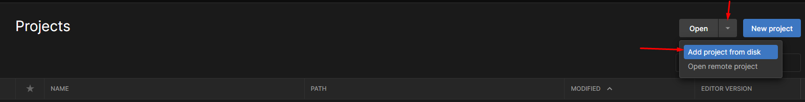

# README

# TestRobot-BB-8

Proyecto mecánicas robot BB-8

Este proyecto está orientado a desarrollar un videojuego teniendo al personaje principal como una esfera en mi caso escogí al robot BB-8 con una serie de mecánicas las cuales consisten en poderse mover con las teclas AWSD y adicionalmente tener un Jetpack con algunas variables disponibles en el inspector para poder ser cambiadas a gusto del cliente.

## Requisitos

- Instale UnityHub
- Instale la versión correspondiente de Unity  2021.3.13f

## Como implementar el proyecto en local

Siguiendo estos pasos podrás implementar el proyecto en tu equipo sin ningún problema.

 

- Paso 1: Clone el repositorio

```bash
git clone https://github.com/EdissonRivera/TestRobot-BB-8.git
```

- Paso 2:  Agregar proyecto a Unity Hub




- Paso3: Abra el proyecto

